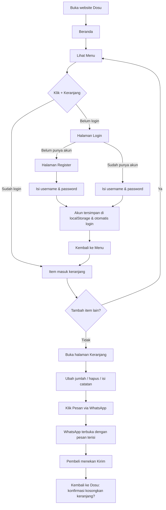
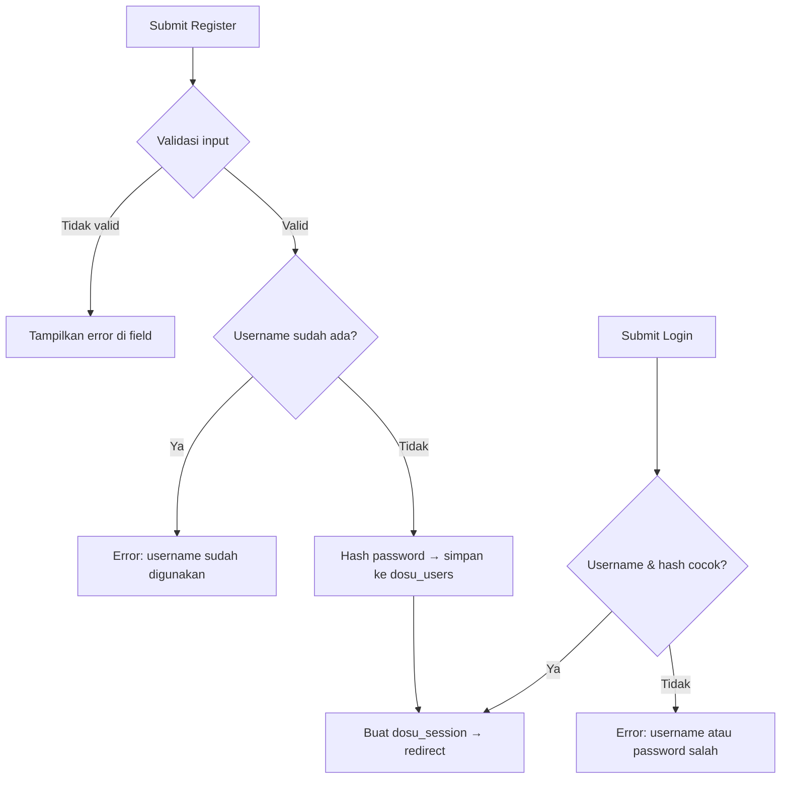
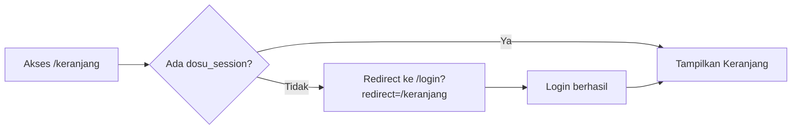

# PRD — Website Dosu (Donat Susu)

> **Tagline:** *lembut, manis, penuh susu*
> **Versi:** 1.0 · **Tech stack:** Vue.js 3 (frontend only, tanpa backend)

---

## 1. Ringkasan Produk

**Dosu** adalah website toko online donat susu. Pelanggan dapat melihat menu, memasukkan donat ke keranjang, lalu memesan lewat WhatsApp penjual. Website ini bersifat *frontend-only*: data akun dan keranjang disimpan di `localStorage` browser, tanpa server.

### Tujuan
- Memberi tampilan toko yang lembut dan menggemaskan, sesuai identitas logo Dosu.
- Memudahkan pelanggan memilih donat dan memesan dalam beberapa langkah.
- Menyederhanakan proses pemesanan ke penjual lewat pesan WhatsApp yang sudah terformat rapi.

### Di luar cakupan (v1)
- Pembayaran online / payment gateway
- Backend, database server, dan panel admin
- Verifikasi email / reset password
- Pelacakan status pesanan

---

## 2. Target Pengguna

| Persona | Kebutuhan |
|---|---|
| Pembeli umum (remaja–dewasa muda) | Melihat menu yang menarik, memesan cepat dari HP |
| Pembeli pesanan banyak (acara/kantor) | Mengatur jumlah item per donat dan mengirim rincian pesanan sekaligus |
| Pemilik toko | Menerima pesanan yang jelas (nama, item, jumlah, total) lewat WhatsApp |

Prioritas perangkat: **mobile-first**, tetap nyaman di tablet dan desktop.

---

## 3. Design / Frontend

### 3.1 Konsep Visual
Tema diambil dari logo Dosu: **"winter milk"** — lembut, bersih, seperti susu dan salju. Elemen khasnya adalah huruf bulat tebal berwarna biru keabu-abuan dengan outline krem seperti krim susu, latar biru pucat, kepingan salju, cipratan susu, dan donat bertabur gula halus.

**Kata kunci gaya:** soft, creamy, rounded, dreamy, minimalis, sedikit "kawaii".

### 3.2 Palet Warna

Nilai di bawah adalah perkiraan dari logo; sesuaikan bila perlu dengan color picker pada file aslinya.

| Nama Token | Hex | Penggunaan |
|---|---|---|
| `--cream` | `#FFF6EC` | Latar utama halaman |
| `--milk` | `#FFFDF9` | Kartu, modal, permukaan |
| `--periwinkle` | `#9AA6CB` | Warna primer: heading, tombol, ikon |
| `--periwinkle-dark` | `#6F7CA8` | Teks tombol hover, link, fokus |
| `--frost` | `#DCE4F3` | Latar seksi sekunder, border lembut |
| `--frost-light` | `#EEF2FA` | Latar input, badge |
| `--dough` | `#F1C48B` | Aksen hangat (harga, highlight, badge) |
| `--text` | `#4A5273` | Teks utama (biru tua lembut, bukan hitam) |
| `--text-muted` | `#8A91AE` | Teks pendukung |
| `--success` | `#7CC5A0` | Notifikasi berhasil |
| `--danger` | `#E58C9A` | Error / hapus (pink lembut) |

### 3.3 Tipografi
- **Heading / logo-style:** `Fredoka` (Google Fonts), bobot 500–700. Bentuknya bulat dan tebal, mirip huruf pada logo.
- **Body:** `Nunito`, bobot 400–700.
- **Aksen Jepang** (opsional, untuk label dekoratif "ミルクドーナツ"): `Zen Maru Gothic`.
- Skala ukuran: 14 / 16 / 20 / 28 / 40 px. Heading hero boleh lebih besar di desktop.

### 3.4 Bahasa Visual & Komponen
- **Radius:** besar dan membulat (`16px` kartu, `999px` tombol dan badge).
- **Bayangan:** lembut dan tersebar, misalnya `0 8px 24px rgba(154,166,203,.25)`.
- **Efek "krim":** teks judul memakai `text-shadow` atau `-webkit-text-stroke` krem agar meniru outline huruf pada logo.
- **Dekorasi:** kepingan salju SVG tipis, titik-titik kecil, dan cipratan susu sebagai pemisah antar seksi (`border-radius` organik atau SVG wave).
- **Tombol primer:** latar `--periwinkle`, teks putih, bulat penuh, hover naik 2px dengan bayangan.
- **Tombol sekunder:** outline `--periwinkle`, latar `--milk`.
- **Input:** latar `--frost-light`, border `--frost`, fokus berupa ring `--periwinkle`.
- **Animasi:** halus dan singkat (200–300ms). Contohnya salju jatuh pelan di hero, donat memantul kecil saat ditambahkan ke keranjang, dan kartu terangkat saat hover. Hormati `prefers-reduced-motion`.
- **Ikon:** set ikon garis tebal membulat (misalnya Lucide).

### 3.5 Struktur Halaman & Layout

**Navbar (semua halaman)**
- Kiri: logo Dosu (versi kecil).
- Tengah/kanan: Beranda, Menu, Keranjang (dengan badge jumlah item), dan Masuk/Daftar atau menu akun (nama pengguna + Keluar).
- Mobile: hamburger menu, dan ikon keranjang tetap terlihat.

**Footer**
- Logo, tagline, tautan WhatsApp, dan hak cipta.

**1) Beranda (`/`)**
- *Hero:* judul "dosu", tagline "lembut, manis, penuh susu", gambar donat dengan cipratan susu, tombol "Lihat Menu".
- *Keunggulan:* 3 kartu kecil (misalnya Lembut, Manis, Penuh Susu).
- *Menu unggulan:* 3–4 produk terlaris.
- *Cara memesan:* 3 langkah bergambar (Pilih → Keranjang → Pesan via WhatsApp).
- *CTA akhir:* ajakan memesan.

**2) Menu (`/menu`)**
- Grid produk: 2 kolom (mobile), 3–4 kolom (desktop).
- Kartu produk: foto, nama, deskripsi singkat, harga, tombol "+ Keranjang".
- Filter kategori (Semua / Original / Topping) dan kolom pencarian sederhana.

**3) Detail Produk (`/menu/:id`)** *(opsional, prioritas rendah)*
- Foto besar, deskripsi, pemilih jumlah, dan tombol tambah ke keranjang.

**4) Keranjang (`/keranjang`)**
- Daftar item: foto kecil, nama, harga, tombol − / + jumlah, tombol hapus, dan subtotal item.
- Ringkasan: total item dan total harga.
- Kolom "Catatan pesanan" (opsional).
- Tombol "Pesan via WhatsApp".
- *Empty state:* ilustrasi donat dan tombol "Belanja dulu yuk".

**5) Login (`/login`) dan Register (`/register`)**
- Kartu di tengah dengan latar salju lembut dan logo di atasnya.
- Login: Username, Password, tombol Masuk, dan tautan ke Daftar.
- Register: Username, Password, Konfirmasi Password, tombol Daftar, dan tautan ke Masuk.
- Tombol tampilkan/sembunyikan password dan pesan error di bawah field.

### 3.6 Responsivitas

| Breakpoint | Lebar | Perilaku |
|---|---|---|
| Mobile | < 640px | 1–2 kolom, navbar hamburger, tombol lebar penuh |
| Tablet | 640–1024px | 2–3 kolom |
| Desktop | > 1024px | 3–4 kolom, konten maksimum 1200px di tengah |

### 3.7 Aksesibilitas
- Kontras teks minimal 4.5:1. Pada latar krem gunakan `--text`, bukan `--periwinkle`, untuk teks kecil.
- Semua gambar punya `alt`; tombol ikon punya `aria-label`.
- Navigasi keyboard dan indikator fokus yang jelas.

---

## 4. Tech Stack & Struktur Proyek

| Kebutuhan | Pilihan |
|---|---|
| Framework | Vue 3 (Composition API, `<script setup>`) |
| Build tool | Vite |
| Routing | Vue Router 4 |
| State management | Pinia |
| Styling | CSS dengan variabel (`:root`) atau Tailwind CSS (pilih salah satu) |
| Persistensi | `localStorage` |
| Ikon | `lucide-vue-next` |
| Font | Google Fonts (Fredoka, Nunito) |

```
dosu/
├─ public/
│  └─ logo-dosu.png
├─ src/
│  ├─ assets/            # gambar produk, ikon salju, styles global
│  ├─ components/
│  │  ├─ AppNavbar.vue
│  │  ├─ AppFooter.vue
│  │  ├─ ProductCard.vue
│  │  ├─ CartItem.vue
│  │  ├─ QuantityStepper.vue
│  │  ├─ SnowDecor.vue
│  │  └─ ToastMessage.vue
│  ├─ data/
│  │  └─ products.js     # data menu (statis)
│  ├─ stores/
│  │  ├─ auth.js         # Pinia: user & sesi
│  │  └─ cart.js         # Pinia: keranjang
│  ├─ utils/
│  │  ├─ storage.js      # helper localStorage (try/catch)
│  │  ├─ hash.js         # hashing password
│  │  └─ whatsapp.js     # pembuat pesan & URL WhatsApp
│  ├─ views/
│  │  ├─ HomeView.vue
│  │  ├─ MenuView.vue
│  │  ├─ CartView.vue
│  │  ├─ LoginView.vue
│  │  └─ RegisterView.vue
│  ├─ router/index.js
│  ├─ App.vue
│  └─ main.js
└─ index.html
```

---

## 5. Core Features

### F1. Autentikasi berbasis Username (localStorage)

**Register**
- Field: `username`, `password`, `konfirmasi password`.
- Validasi:
  - Username 3–20 karakter, hanya huruf, angka, titik, dan underscore. Tidak peka huruf besar/kecil (disimpan huruf kecil).
  - Username harus unik. Jika sudah dipakai, tampilkan "Username sudah digunakan".
  - Password minimal 6 karakter dan harus sama dengan konfirmasi.
- Setelah berhasil: pengguna disimpan, otomatis login, lalu diarahkan ke Menu (atau halaman yang dituju sebelumnya).

**Login**
- Field: `username` dan `password`.
- Jika tidak cocok, tampilkan pesan umum "Username atau password salah" (tanpa membocorkan mana yang salah).

**Logout**
- Menghapus sesi aktif. Data pengguna dan keranjangnya tetap tersimpan.

**Proteksi halaman (route guard)**
- Halaman Beranda dan Menu bisa dilihat siapa saja.
- Menambah ke keranjang dan membuka `/keranjang` **memerlukan login**. Jika belum login, arahkan ke `/login` dan kembalikan ke halaman semula setelah berhasil (`?redirect=`).
- Halaman `/login` dan `/register` mengarahkan pengguna yang sudah login ke Menu.

**Skema localStorage**

| Key | Isi | Contoh |
|---|---|---|
| `dosu_users` | Array pengguna | `[{ "id": "u_1", "username": "rina", "passwordHash": "…", "createdAt": "2026-09-30T…" }]` |
| `dosu_session` | Pengguna yang sedang login | `{ "userId": "u_1", "username": "rina" }` |
| `dosu_cart_<userId>` | Keranjang milik pengguna | `[{ "productId": "p1", "qty": 2 }]` |

> **Catatan keamanan:** `localStorage` bisa dibaca dan diubah siapa pun yang memakai browser tersebut, sehingga ini **bukan autentikasi yang aman**. Untuk v1, password tidak disimpan sebagai teks biasa: gunakan hash SHA-256 dengan salt lewat Web Crypto API (`crypto.subtle.digest`). Bila kelak ada data sensitif atau pembayaran, pindahkan ke backend sungguhan.

### F2. Katalog Menu Donat
- Data produk disimpan statis di `src/data/products.js`:

```js
{ id: 'p1', name: 'Donat Susu Original', description: 'Lembut dengan taburan gula halus',
  price: 8000, image: '/img/original.jpg', category: 'original', available: true }
```

- Tampilan grid, filter kategori, dan pencarian nama.
- Harga diformat rupiah (`Rp 8.000`) dengan `Intl.NumberFormat('id-ID')`.
- Produk dengan `available: false` menampilkan label "Habis" dan tombol nonaktif.
- Isi menu, harga, dan foto adalah **placeholder** dan perlu diganti dengan menu asli.

### F3. Keranjang Belanja
Barang **tidak langsung dipesan**. Semua barang harus masuk keranjang lebih dulu.

- **Tambah:** tombol "+ Keranjang" di kartu produk. Jika produk sudah ada di keranjang, jumlahnya bertambah 1. Tampilkan toast "Ditambahkan ke keranjang" dan perbarui badge navbar.
- **Ubah jumlah:** tombol − / +. Minimum 1 dan maksimum 99. Menekan − pada jumlah 1 meminta konfirmasi hapus.
- **Hapus item** dan **Kosongkan keranjang**.
- **Total:** subtotal per item dan total keseluruhan dihitung otomatis (getter Pinia).
- **Persisten:** keranjang tersimpan di `localStorage` per pengguna (`dosu_cart_<userId>`) sehingga tetap ada setelah browser ditutup dan tidak tercampur antar akun.
- **Catatan pesanan** (opsional, maksimal 200 karakter) ikut dikirim ke WhatsApp.

### F4. Pemesanan via WhatsApp
- Nomor tujuan: **+62 895-4142-96707**. Format untuk tautan: `62895414296707` (tanpa `+`, spasi, dan tanda hubung). Simpan sebagai konstanta di satu tempat (misalnya `.env` → `VITE_WA_NUMBER`) agar mudah diganti.
- Tombol "Pesan via WhatsApp" di halaman Keranjang **nonaktif jika keranjang kosong**.
- Saat ditekan, aplikasi menyusun pesan, meng-encode dengan `encodeURIComponent`, lalu membuka `https://wa.me/62895414296707?text=<pesan>` di tab baru.
- **Format pesan:**

```
Halo Dosu! Saya ingin memesan:

1. Donat Susu Original x2 = Rp 16.000
2. Donat Susu Coklat x3 = Rp 27.000

Total: Rp 43.000

Catatan: tanpa kacang ya

Nama pemesan: rina
```

- Setelah WhatsApp dibuka, tampilkan dialog: "Pesanan sudah terkirim? Kosongkan keranjang?" dengan pilihan **Ya, kosongkan** atau **Simpan dulu**. Keranjang tidak dikosongkan otomatis, karena aplikasi tidak bisa memastikan pesan benar-benar terkirim.

### F5. Fitur Pendukung
- Toast notifikasi (berhasil, error).
- Empty state di keranjang dan hasil pencarian.
- Navbar responsif dengan badge keranjang.
- Halaman 404 sederhana bertema Dosu.

---

## 6. User Flow

### 6.1 Alur Utama (Pembeli Baru)



### 6.2 Alur Autentikasi



### 6.3 Alur Route Guard



---

## 7. Peta Route

| Path | Halaman | Akses |
|---|---|---|
| `/` | Beranda | Publik |
| `/menu` | Menu | Publik |
| `/keranjang` | Keranjang | Login |
| `/login` | Login | Tamu saja |
| `/register` | Register | Tamu saja |
| `/:pathMatch(.*)*` | 404 | Publik |

---

## 8. Kebutuhan Non-Fungsional
- **Performa:** gambar produk dikompres (WebP, maksimal ±100 KB) dan memakai `loading="lazy"`.
- **Kompatibilitas:** Chrome, Safari, Firefox, dan Edge versi terbaru, termasuk Chrome Android dan Safari iOS.
- **Ketahanan penyimpanan:** semua akses `localStorage` dibungkus `try/catch` (mode privat atau kuota penuh) dan aplikasi tetap berjalan dengan pesan yang jelas.
- **SEO dasar:** `<title>`, meta description, dan Open Graph memakai logo Dosu.
- **Deploy:** hosting statis (Netlify, Vercel, atau GitHub Pages).

---

## 9. Kriteria Penerimaan (Acceptance Criteria)

- [ ] Tampilan konsisten dengan palet dan gaya logo Dosu di semua halaman, dan nyaman di layar HP.
- [ ] Pengguna dapat mendaftar dengan username (bukan email), dan username duplikat ditolak.
- [ ] Login gagal menampilkan pesan error, dan login berhasil membuat sesi yang bertahan setelah refresh.
- [ ] Data pengguna tersimpan di `localStorage`, dan password tidak tersimpan sebagai teks biasa.
- [ ] Tidak ada tombol "beli/pesan langsung" di kartu produk; hanya "+ Keranjang".
- [ ] Keranjang bisa ditambah, diubah jumlahnya, dihapus, dan totalnya benar.
- [ ] Keranjang tetap ada setelah refresh dan terpisah untuk tiap akun.
- [ ] Tombol "Pesan via WhatsApp" membuka `wa.me/62895414296707` dengan pesan berisi daftar item, jumlah, harga, total, catatan, dan nama pemesan.
- [ ] Halaman keranjang dan aksi tambah ke keranjang tidak bisa diakses tanpa login.

---

## 10. Rencana Pengerjaan (Milestone)

| Tahap | Isi |
|---|---|
| 1. Setup | Inisialisasi Vite + Vue 3, Router, Pinia, font, variabel warna |
| 2. UI dasar | Navbar, footer, Beranda, dekorasi salju dan susu |
| 3. Auth | Register, Login, hashing, session, route guard |
| 4. Menu | Data produk, kartu produk, filter, dan pencarian |
| 5. Keranjang | Store Pinia, persistensi localStorage, halaman keranjang |
| 6. WhatsApp | Pembuat pesan, tautan `wa.me`, dialog konfirmasi |
| 7. Poles | Responsif, animasi, aksesibilitas, 404, tes manual, deploy |

---

## 11. Asumsi & Pertanyaan Terbuka

**Asumsi yang dipakai di dokumen ini**
- Melihat menu boleh tanpa login, tetapi menambah ke keranjang memerlukan login.
- Pembayaran dan pengiriman dibicarakan langsung lewat WhatsApp.
- Data menu, harga, dan foto masih placeholder.

**Perlu dikonfirmasi**
1. Daftar menu asli: nama, harga, varian rasa, dan foto produk.
2. Apakah perlu kolom alamat pengiriman atau pilihan "ambil di tempat" di keranjang?
3. Apakah ada jam operasional atau minimal pemesanan yang perlu ditampilkan?
4. Apakah logo akan dipakai apa adanya, atau perlu versi transparan (tanpa latar krem) untuk navbar?
5. Nomor WhatsApp: pastikan `+62 895-4142-96707` sudah benar dan aktif, karena tautan akan memakai nomor ini persis.
